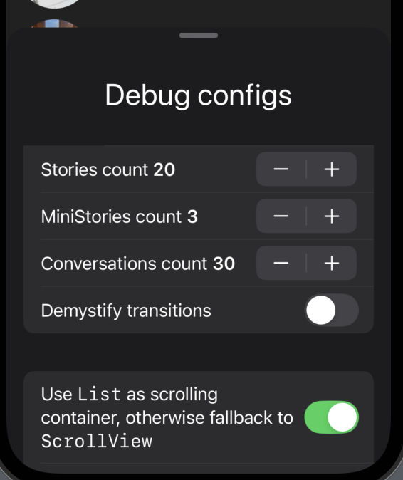

# Stories interactive transitions

### Checkpoints (derived from [task's requirements](NDA))

#### Logical

- [x] Stories open and close automatically as you scroll the main vertical ScrollView. In other words, the scroll position of the main vertical ScrollView drives the opening and closing of stories.
- [x]Preserve the horizontal scroll position of the stories ScrollView when it is closed and reopened:
    - [x] This should support the following scenario:
        - [x] 1. Scroll the stories horizontally toward the end.
        - [x] 2. Start closing the stories.
        - [x] 3. The same story item views participate in the closing transition.
        - [x] 4. Close the stories.
        - [x] 5. Reopen the stories.
        - [x] 6. Restore the same stories that were visible before closing.
        - [x] 7. Display them in their previous scroll state
        - [x] 8. Allow horizontal scrolling to continue seamlessly.
- [x] In the closed state, only 3 stories are visible. These are the first 3 stories in the global stories list.

#### Technical

- [x] iOS target 17.0+
- [x] Swift 6
- [x] Use the latest Observation framework version (so no usage of @StateObject and etc.)

### Comments

- `Kingfisher` is integrated only in favour of images' cache

- There is button on the main screen that presents debug menu which allows simulating different data states, show transition hints or switch between implementations

- Debug Menu

